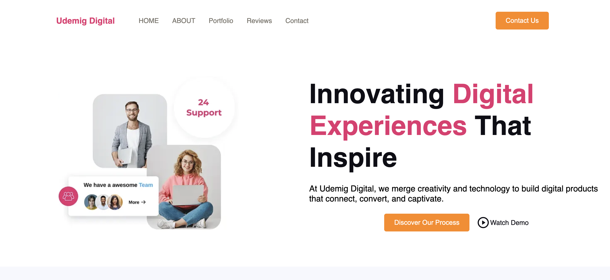
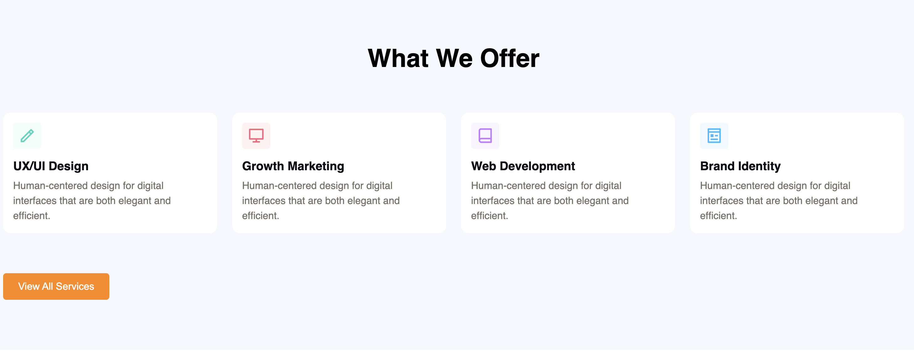
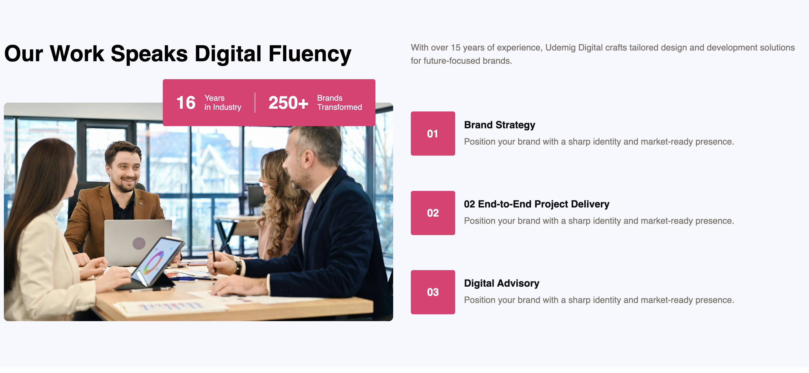
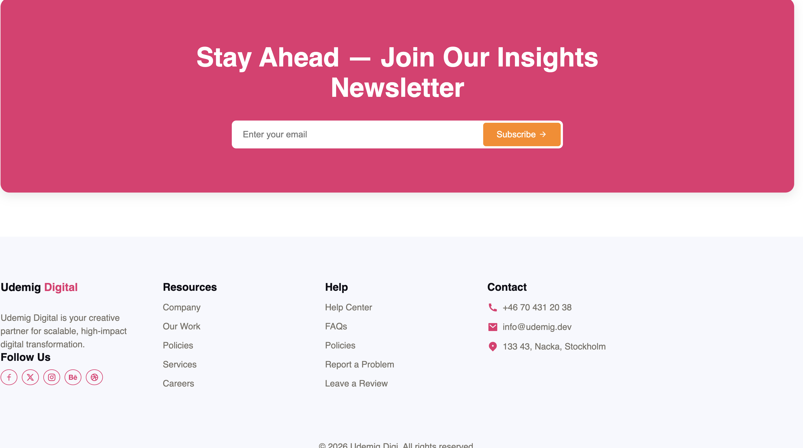
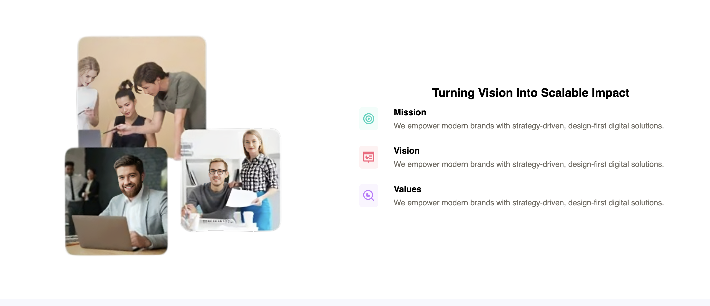

# 🌐 Udemig Digital Clone

A modern, responsive digital agency website built using HTML5 and SCSS.  
This project is developed to improve frontend development skills and practice clean, maintainable code.

---

## 📌 Project Overview

This project focuses on:

- Writing clean and readable code  
- Creating modular SCSS structure  
- Building responsive layouts  
- Following modern UI/UX principles  
- Organizing project structure properly  

---

## ✨ Features

- 📱 Fully responsive design (mobile, tablet, desktop)  
- 🎨 Modern and minimal UI  
- 🧩 Modular SCSS architecture  
- ⚡ Performance-focused structure  
- 📑 Sections included:
  - Hero  
  - About  
  - Services  
  - Portfolio  
  - Reviews  
  - Contact  
  - Footer  

---

## 🛠 Technologies Used

- HTML5  
- SCSS (Sass)  
- CSS3  
- Git & GitHub  

---

## 📁 Project Structure

---

## 📷 Screenshots

  
  
  
  
  

---

## 🎯 Purpose

The purpose of this project is to:

- Practice SCSS and modern frontend structure  
- Improve responsive design skills  
- Gain experience with Git & GitHub  
- Build a clean and scalable project architecture  

---

## 👩‍💻 Author

**Naila Azeri**

- GitHub: https://github.com/nailaazeri-svg  

---

⭐ If you like this project, please give it a star!
